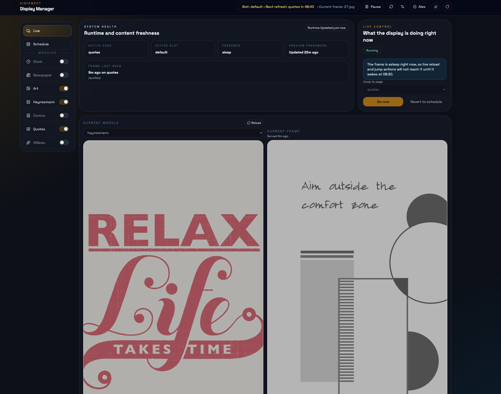
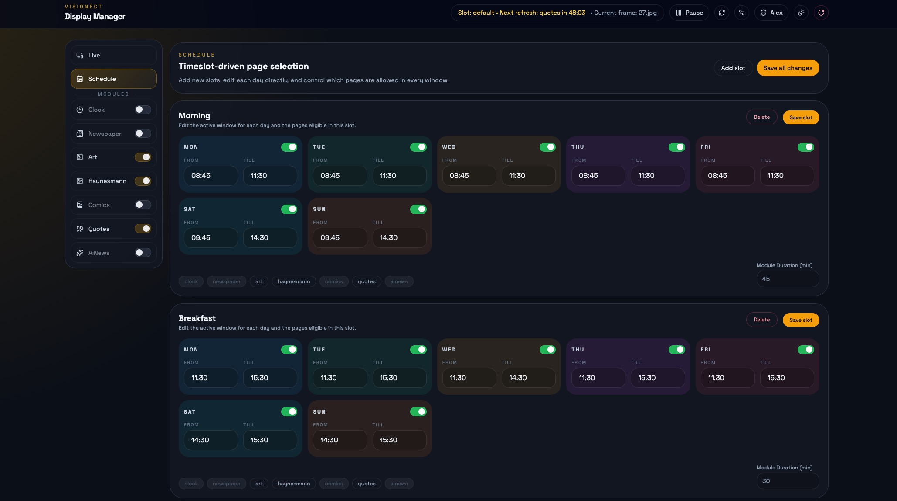
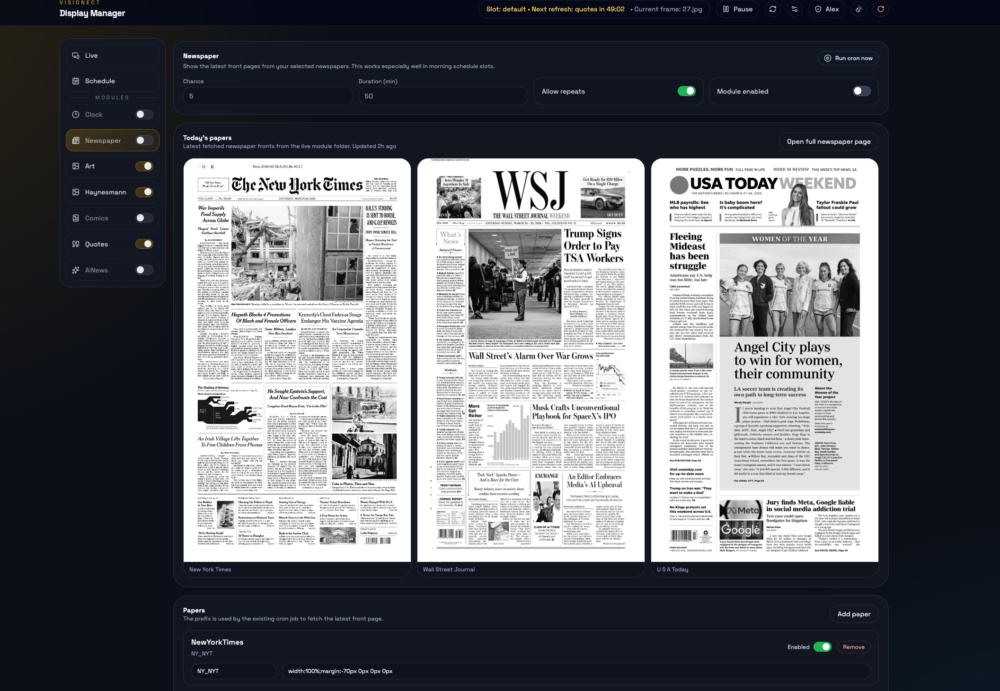
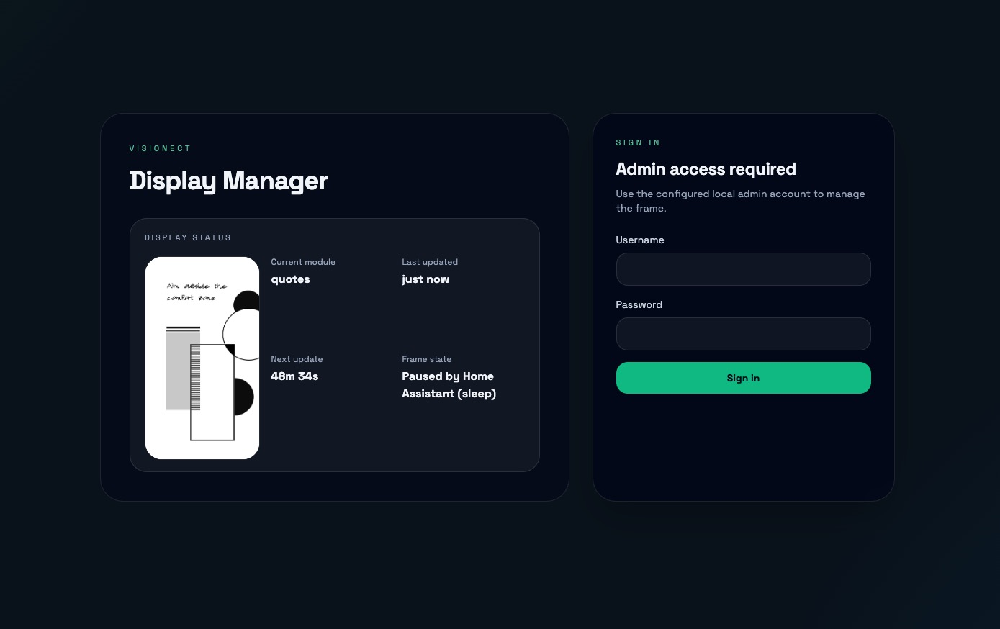
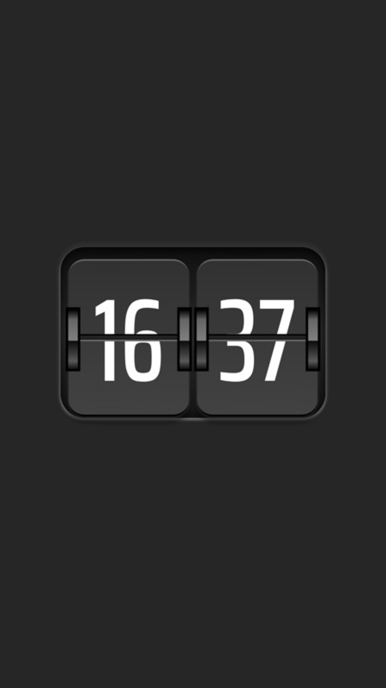
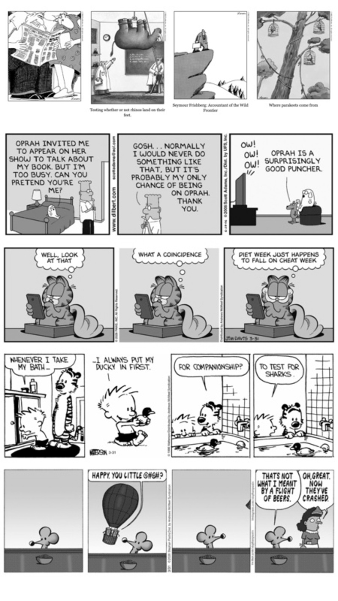

# Visionect Display Manager

A self-hosted PHP control panel and content app for a Visionect e-ink frame, packaged with Docker Compose and built around a live admin UI, module previews, scheduling, manual overrides, and Home Assistant / Node-RED automation hooks.

This project is designed around the [Visionect Place & Play 32](https://www.visionect.com/shop/place-play-32/) frame and a portrait rendering target of `1440 × 2560`.

Initial module design, the original project idea, and the early cron-based content pipeline are credited to Arjan Haverkamp.

This project was built and iterated with AI assistance. The codebase, admin workflows, setup flow, documentation, and UI refinements were developed through an AI-assisted collaboration process rather than as a purely hand-written one-shot build.

## Screenshots

### Live dashboard



### Schedule editor



### Newspaper module



### Login screen



### Frame example


## Quick Setup

1. Clone this repo onto the machine that will host the stack.
2. Copy `.env.example` to `.env`.
3. Make sure Docker and Docker Compose are installed.
4. Start the stack:

```bash
docker compose up -d --build
```

5. Open:

- Visionect server admin: `http://YOUR_HOST:8081`
- Display manager admin: `http://YOUR_HOST:4412/admin/`
- Public frame shell: `http://YOUR_HOST:4412/`

6. On first visit to `/admin`, create the single admin account.
7. Open the module panels and configure any API keys or sources you need.
8. For `Newspaper`, `Comics`, and `AiNews`, use the manual run buttons in `/admin` once so the first content is generated immediately.
9. In `General` settings, keep the frame resolution set to your real panel size. For the Visionect Place & Play 32 used here, that is `1440 × 2560`.
10. If you already use the frame's own UI sleep schedule, mirror that same `Wake time` and `Sleep time` in `General` settings so the dashboard knows when the screen is asleep and can avoid misleading live actions.

Out-of-the-box demo behavior:

- `Art`, `Haynesmann`, `Quotes`, and `Comics` ship with sample images
- `Newspaper` ships with two example paper selections and bundled sample front pages
- `AiNews` ships with sample story data and example images so the module can render before you add provider keys

This means a fresh clone can show real content immediately even before you configure any API keys.

## What The Admin UI Gives You

- live frame health, current module, and exact last-served asset tracking
- a `Current frame` preview based on the actual URL the frame last requested
- a `Current module` preview tool so you can test modules without waiting for the schedule
- per-module enable toggles in both the sidebar and module panels
- manual cron buttons for `Newspaper`, `Comics`, and `AiNews`
- local-first automation hooks through `control.php`
- `General` settings for frame resolution and mirrored frame sleep times
- `Home Assistant` settings for presence pause

The sleep schedule in this app does not put the panel to sleep by itself. It mirrors the sleep window you already configured on the physical frame so the admin UI can show the correct state, avoid pretending that reload or jump actions will take effect while the panel is asleep, and show wake time as the next update target while asleep.

## Important Warning About Visionect Server Image

Use:

- `visionect/visionect-server-v3:7.6.5-arm`

Do not casually upgrade the `vss` container image beyond that.

Later Visionect Server versions after `7.6.5-arm` require a subscription. This repo intentionally keeps the Docker Compose example pinned to `visionect/visionect-server-v3:7.6.5-arm`.

## What This Repo Contains

- `app/`
  - the PHP app, module code, admin UI, scheduler worker, and runtime helpers
- `docker-compose.yml`
  - full stack example for Visionect Server, PostgreSQL, Redis, and the custom PHP/Apache app
- `docker/php-apache/Dockerfile`
  - the image used for the custom web app / scheduler / websocket worker

## Easy AI-Friendly Setup Guide

If you hand this GitHub repo to an AI assistant, the minimum setup context it should follow is:

1. Start Docker Compose from the repo root.
2. Keep the `vss` image pinned to `visionect/visionect-server-v3:7.6.5-arm`.
3. Use `/admin` first-run setup to create the admin account.
4. Use `/admin` to configure:
   - General frame settings
   - Home Assistant presence pause
   - AiNews provider keys
   - Newspaper list
   - Schedule and module enablement
5. Use the manual module-run buttons to fetch initial content.
6. Use `http://HOST:4412/control.php` for Node-RED / Home Assistant automations instead of the raw websocket.

## Requirements

- Docker Engine
- Docker Compose
- an ARM host that can run `visionect/visionect-server-v3:7.6.5-arm`
- access to a Visionect frame / Visionect Server environment
- outbound internet access if you want:
  - newspaper fetching
  - comics fetching
  - AiNews RSS + provider image generation
  - Home Assistant API integration

## No-Credentials Demo Mode

The repo is intentionally usable before you configure secrets.

Works right away:

- Clock
- Art
- Haynesmann
- Quotes
- Comics
- Newspaper using bundled sample front pages and two example configured papers
- AiNews using bundled example stories and images

Useful without credentials but with manual refresh:

- `Newspaper` can rotate bundled sample front pages
- `Comics` can render the bundled sample strips immediately
- `AiNews` can show bundled sample stories even before you add any provider keys

Needs credentials only for regeneration or live integrations:

- AiNews image generation providers
- Home Assistant pause integration

## Environment Setup

Create `.env` from `.env.example`:

```env
TZ=America/Phoenix
PUID=1000
PGID=1000
```

These values are used by the containers for timezone and file ownership.

## Docker Compose Details

The Compose stack includes:

- `vss`
  - Visionect Server
- `postgres_db`
  - PostgreSQL for Visionect Server
- `redis`
  - Redis for Visionect Server
- `php-apache`
  - the custom display manager app, cron runner, and websocket worker
- `cookie-refresh`
  - GoComics BunnyCDN bypass service (see below)

Published ports:

- `8081`
  - Visionect Server admin
- `4412`
  - public display shell and admin UI
- `12345`
  - websocket runtime server used by the frame shell and admin

## First-Run Behavior

The public repo does not ship an admin account or secret key.

At runtime, the app generates or creates:

- `app/config/admin_account.json`
- `app/config/secret_key.b64`
- `app/config/runtime_status.json`
- `app/config/remote_control.json`
- `app/config/ha_integration.json`
- `app/config/general_settings.json`

Reference examples included in the repo:

- `app/config/ha_integration.example.json`
- `app/config/general_settings.example.json`

The first time you visit `/admin`:

- if no admin account exists, you will see the first-run setup screen
- the first-run screen creates the single admin account
- passwords are hashed
- Home Assistant tokens and AiNews provider keys are encrypted at rest once entered

## Supported Modules

### Clock

<table><tr>
<td></td>
<td valign="top">

- multiple styles (flip clock and word clock)
- style enablement from the admin UI
- frame-friendly preview cards
- useful as a no-credentials fallback module

</td>
</tr></table>

### Newspaper

<table><tr>
<td></td>
<td valign="top">

- add papers from a scraped list
- add papers manually by tag like `NY_NYT`
- enable or disable individual papers
- manual fetch from the admin
- the paper picker scrapes available paper codes from Freedom Forum / Newseum-style front page PDF listings
- live fetches download front page PDFs from `cdn.freedomforum.org`, convert them to grayscale JPGs, and rotate the latest image for each enabled paper
- server-side paper selection so runtime tracking can record the exact paper served
- bundled sample papers are included so a fresh install can preview the module immediately

</td>
</tr></table>

### Art

<table><tr>
<td></td>
<td valign="top">

- random grayscale JPG artwork
- upload and manage images in the admin UI
- exact frame tracking records the actual image file served to the panel

</td>
</tr></table>

### Haynesmann

<table><tr>
<td></td>
<td valign="top">

- random grayscale image gallery module
- managed like the other art-style modules
- exact frame tracking records the actual image file served to the panel

</td>
</tr></table>

### Comics

<table><tr>
<td></td>
<td valign="top">

- configurable strip order
- Far Side and Dilbert support
- additional GoComics strips by URL
- manual cron run from the admin
- sample strips are bundled so the module renders even before live fetching works
- **automatic GoComics cookie bypass** via the `cookie-refresh` Docker service (see below)

</td>
</tr></table>

### Quotes

<table><tr>
<td></td>
<td valign="top">

- random grayscale quote image gallery
- exact frame tracking records the actual image file served to the panel

</td>
</tr></table>

### AiNews

<table><tr>
<td></td>
<td valign="top">

- RSS aggregation
- summary + image generation
- configurable provider order
- configurable `kie.ai` model
- manual generation from the admin
- bundled sample stories and images are included so the module still displays without credentials
- the admin preview shows title, summary, and the generated image together

</td>
</tr></table>

## GoComics Cookie Bypass (`cookie-refresh` service)

GoComics is served behind BunnyCDN, which issues an Argon2id proof-of-work challenge to non-browser HTTP clients. Plain curl requests are blocked.

The `cookie-refresh` Docker service solves this automatically:

1. On container start and at **05:55 and 15:55 UTC** each day, it runs `docker/docker-cookie-refresh/refresh.py`
2. The script performs the challenge handshake and receives a valid session cookie
3. The cookie set is written to `app/config/gocomics_auth.json` (gitignored)
4. The PHP comics cron reads `gocomics_auth.json` and injects the cookies into GoComics requests
5. If `auth.json` is missing or expired when the PHP cron runs, it waits up to 3 minutes for the refresh service to complete

The refresh runs 10 minutes before each scheduled comics cron (06:05 and 16:05 UTC) to ensure cookies are always fresh.

### Manual cookie fallback

If auto-refresh fails, you can paste fresh cookies manually:

1. Create a free account at [gocomics.com](https://www.gocomics.com) if you don't have one
2. Log in to your GoComics account in Chrome
3. Install the [Get cookies.txt Locally](https://chromewebstore.google.com/detail/get-cookiestxt-locally/cclelndahbckbenkjhflpdbgdldlbecc) Chrome extension
4. While logged in, click the extension → Copy All
5. In the admin UI, open the **Comics** panel → **Cookie settings** button → paste and save

A free GoComics account is sufficient — no paid subscription needed. Being logged in ensures the full cookie set is present when copying.

The admin UI shows current cookie expiry status and warns when cookies are missing or expired.

## Local Automation / Home Assistant / Node-RED

Do not use the raw websocket directly for external automation.

Use:

- `http://HOST:4412/control.php`

Supported tasks:

- `setPage`
- `reloadCurrent`
- `resumeSchedule`
- `pause`
- `unpause`
- `reloadPrefs`

Examples:

- `http://HOST:4412/control.php?task=setPage&page=art`
- `http://HOST:4412/control.php?task=setPage&page=newspaper`
- `http://HOST:4412/control.php?task=reloadCurrent`
- `http://HOST:4412/control.php?task=resumeSchedule`

`setPage` respects module enablement, so disabled modules are ignored.

The control endpoint is intended for local-network automations such as:

- Home Assistant button actions
- Node-RED flows
- simple LAN-only curl shortcuts

Example Node-RED payload:

```json
{"task":"setPage","page":"newspaper"}
```

Example Node-RED `function` node:

```javascript
var task = msg.payload.task;
var page = msg.payload.page || "";

if (!task) {
    node.error("Missing payload.task", msg);
    return null;
}

msg.method = "GET";
msg.url = "http://YOUR_HOST:4412/control.php?task=" + encodeURIComponent(task);

if (page) {
    msg.url += "&page=" + encodeURIComponent(page);
}

return msg;
```

Use that before a standard Node-RED `http request` node with:

- Method: `use`
- URL: blank
- Return: parsed JSON
- Auth: none

## Scheduling and Manual Overrides

- rotation is defined in `app/config/PREFS.json`
- schedule slots control which modules are eligible at different times of day
- manual `Go now` / `setPage` actions create a temporary override
- manual overrides return to schedule automatically after 30 minutes
- if the system is paused, that 30-minute override timer is effectively frozen until unpaused
- if mirrored frame sleep is enabled, the runtime reports `sleep` during the configured window and live control actions should be considered queued or ineffective until wake time
- while asleep, the admin UI treats the next wake time as the real `Next update`

## Gotchas

- Keep the Visionect Server image pinned to `visionect/visionect-server-v3:7.6.5-arm`.
- The app is built around PHP `7.4` in the current Dockerfile.
- The repo intentionally includes sample module content so a fresh clone can render something immediately without secrets.
- HTTPS/network fetches should use `curl`, not plain `file_get_contents()`.
- Image output should remain grayscale `.jpg` for the frame.
- Wrap Imagick work with `ob_start()` / `ob_end_clean()` to avoid corrupting logs.
- `newspaper/cron.php` still uses an older fetch path and could use future cleanup.
- GoComics is served behind BunnyCDN with an Argon2id proof-of-work anti-bot challenge. The `cookie-refresh` service handles this automatically. Without it, GoComics pulls will be blocked.
- Random-content modules cannot predict the exact next asset until the real frame requests it.
- `status.php` and runtime helpers should always read config through `/app/config`, not relative paths from `/var/www/html`.
- the frame sleep settings belong under `General`, not `Home Assistant`; Home Assistant only controls presence pause

## Useful Paths

- `/admin/`
  - admin UI
- `/`
  - public frame shell
- `/status.php`
  - Home Assistant status integration and display websocket bootstrap helper
- `/control.php`
  - local automation endpoint
- `app/cli/visionectd.php`
  - websocket worker and scheduler
- `app/cli/cron.php`
  - master cron runner
